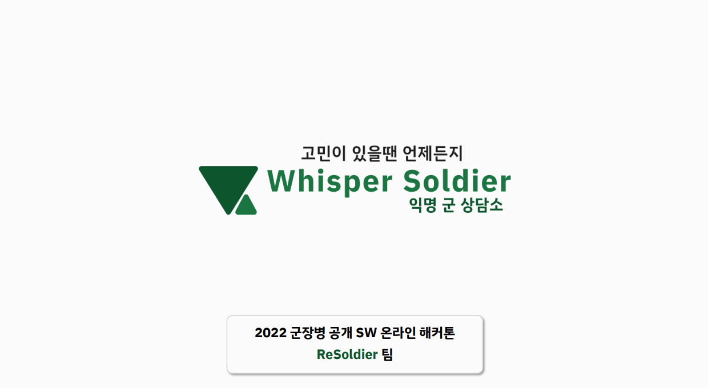
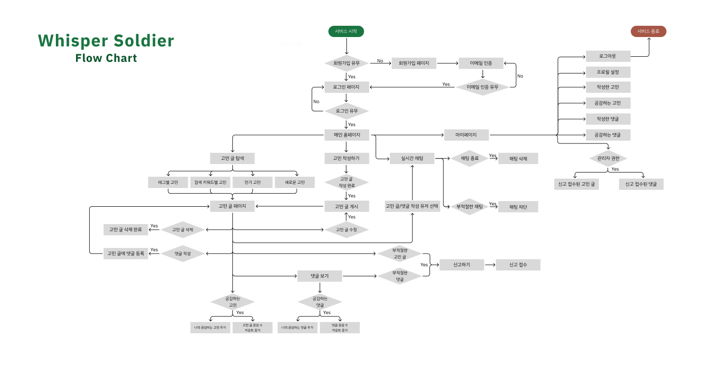
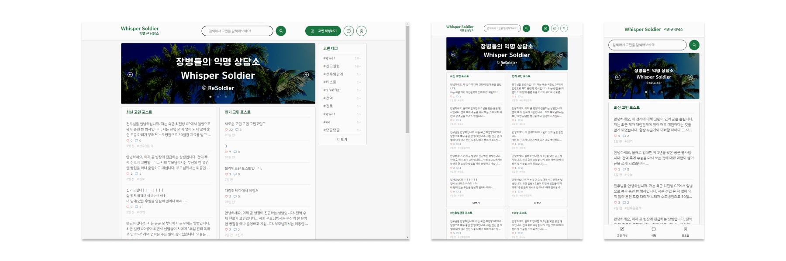
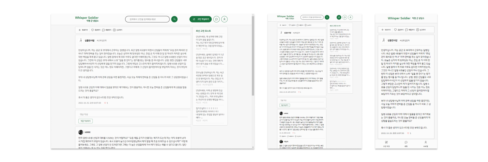
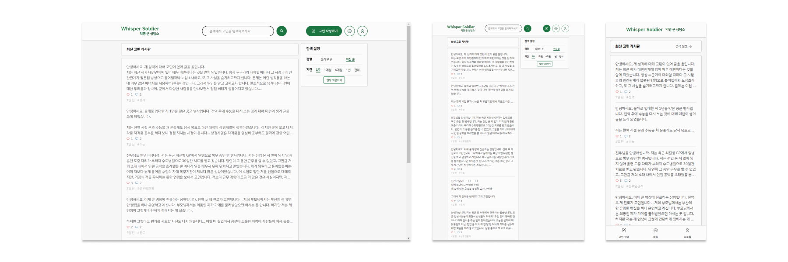
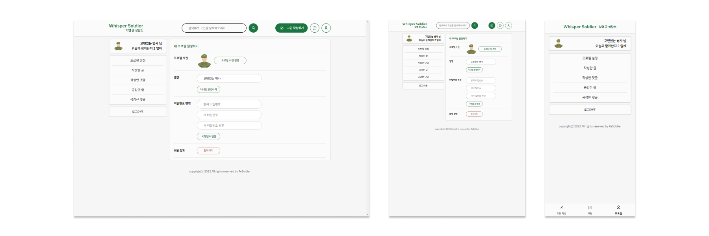

# **WhisperSoldier - 익명 군 상담소**

 

	<a href="https://osam.kr/hackathon/awards?m=v&wdnId=106">
		<b>🏆 OSAM 2022 국방부장관상 수상 🏆</b>
	</a>

 

	

	

*본인 나라사랑포털 이메일로 가입 가능 합니다.

 

	
	
	
	
	
	

 

<table align="center">
	<tr>
		<td align="center"></td>
		<td align="center"></td>
	</tr>
	<tr>
	<td align="center">
		
<a href="https://youtu.be/bAYJvDUx5S4"><b>시연 영상 - Youtube 링크</b></a>

	</td>
	<td align="center">
		
<a href="Image/OSAM_WhisperSoldier_ReSoldier.pdf"><b>발표 자료</b></a>

	</td>
	</tr>	
</table>
 

## :scroll: 목차

> [:page_facing_up: 프로젝트 소개](#page_facing_up-프로젝트-소개)
>
> [:bulb: 주요 기능](#bulb-주요-기능)
>
> [:chart_with_upwards_trend: 서비스 플로우](#chart_with_upwards_trend-서비스-플로우)
>
> [:motorway: 프로젝트 단계](#motorway-프로젝트-단계)
>
> [:clipboard: DB Diagram](#clipboard-db-diagram)
>
> [:iphone: UI/UX](#iphone-uiux)
>
> [:electric_plug: 컴퓨터 구성 / 필수 조건 안내 (Prerequisites)](#electric_plug-컴퓨터-구성--필수-조건-안내-prerequisites)
>
> [:computer:기술 스택 (Technique Used)](#computer기술-스택-technique-used)
>
> [:running:ReSoldier 팀 정보](#runningresoldier-팀-정보)
>
> [:open_file_folder: 저작권 및 사용권 정보 (Copyleft / End User License)](#open_file_folder-저작권-및-사용권-정보-copyleft--end-user-license)

## :page_facing_up: **프로젝트 소개**

> _"오늘도 지적 받았네. 다음엔 더 잘해서 한 사람 몫은 해야 되는데..."_
>
> _"강 병장님 열심히 공부하시네... 나는 개인 정비 시간 때 뭘 해야될까?"_
>
> _"여자친구 생일인데 군인인 내가 어떤 선물을 줘야 좋아할까?"_
>
> _"전역하면 뭐하고 살아야 하지??"_
>
> ...
>
> _"어... 1년 N개월 동안 나 뭐 했지?"_

군 복무를 경험하신 분이라면, 아무에게도 말하지 못하고 마음속에 담아두기만 했던 고민을 적어도 하나씩은 가지고 계셨을 겁니다.

그러나 이런 고민들은 삭혀두기만 했을 때 혼자 해결되기 어렵습니다.

하지만 이런 답답한 고민들에 대해 가장 잘 공감할 수 있는 사람들이 있습니다. 바로, 비슷한 상황에 처한 전우들입니다.

팀원이 실제로 경험해 본 바, 마음에 품고만 있던 고민을 전우에게 털어놓는 것만으로도 스트레스를 줄일 수 있습니다.

그렇다면 서로의 고민에 공감하는 전우님들을 이어주어서 도움과 조언을 주고받으면 어떨까요?

위스퍼솔저는 영내생활자들의 고민을 동료의 시선에서 해결할 수 있도록 돕고자 합니다.

익명성을 활용하여 상담을 주고받는 사용자들을 부대 내에서 입장의 차이로부터 해방하고, 전우 대 전우로서 "속삭이듯이", 안심하고 솔직하게 마음을 털어놓을 수 있게 하고자 합니다.
  

## :bulb: **주요 기능**

<table>
	<tr>
		<td align="center"></td>
	</tr>
	<tr>
		<td align="center">
			
<b>나라사랑포털 이메일 인증</b> 위스퍼솔져를 국군 장병들만 이용할 수 있도록 합니다.

		</td>
	</tr>
</table>
 

<table>
	<tr>
		<td align="center"></td>
		<td align="center"></td>
	</tr>
	<td align="center" colspan="2">
			
<b>고민 글 작성</b> 위스퍼솔져에 자신의 고민을 작성할 수 있습니다.

	</td>
</table>
 

<table>
	<tr>
		<td align="center"></td>
	</tr>
	<td align="center">
			
<b>최신 고민게시판</b> 가장 최근 고민 글을 모아 볼 수 있습니다. 우측 검색 설정에서 정렬과 기간을 변경할 수 있습니다.

	</td>
</table>
 

<table>
	<tr>
		<td align="center"></td>
	</tr>
	<td align="center">
			
<b>인기 고민게시판</b> 전우들이 많이 공감하는 고민이 무엇인지 알 수 있습니다.

	</td>
</table>
 

<table>
	<tr>
		<td align="center"></td>
	</tr>
	<td align="center">
			
<b>실시간 1대 1 채팅</b> 고민 게시판보다 깊고 자세한 상담을  익명의 사용자와 채팅을 통해 진행할 수 있습니다. *고민 글 또는 댓글의 채팅하기를 눌러 채팅을 시작할 수 있습니다.

	</td>
</table>
 

<table>
	<tr>
		<td align="center" colspan="2"></td>
	</tr>
	<tr>
		<td align="center"></td>
		<td align="center"></td>
	</tr>
	<td align="center" colspan="2">
			
<b>키워드 검색과 태그 검색을 활용한 고민 탐색</b> 나와 비슷한 고민을 탐색할 수 있습니다.

	</td>
</table>
 

<table>
	<tr>
		<td align="center"></td>
	</tr>
	<td align="center">
			
<b>단어 필터링</b> 고민 글 또는 댓글 작성 시 커뮤니티에 위배되는 텍스트를 감지하여 해당 글을 게시할 수 없도록 합니다.

	</td>
</table>
 

<table>
	<tr>
		<td align="center"></td>
		<td align="center"></td>
	</tr>
	<tr>
		<td align="center"></td>
	</tr>
	<td align="center" colspan="2">
			
<b>신고 및 차단</b> 부적절한 고민 글 또는 댓글을 신고하거나 부적절한 채팅을 차단할 수 있습니다.

	</td>
</table>
 

<table>
	<tr>
		<td align="center"></td>
		<td align="center"></td>
	</tr>
	<tr>
		<td align="center"></td>
		<td align="center"></td>
	</tr>
	<td align="center" colspan="2">
			
<b>마이 프로필</b> 사용자의 프로필 사진과 닉네임을 설정해 위스퍼 솔저 내 자신을 개성있게 표한 할 수 있습니다. 또한, 본인이 작성하거나 공감한 고민 글, 댓글을 조회할 수 있습니다.

	</td>
</table>
 

<table>
	<tr>
		<td align="center"></td>
		<td align="center"></td>
	</tr>
	<td align="center" colspan="2">
			
<b>관리자 콘텐츠 관리</b> 관리자 계정으로 신고된 고민글과 댓글을 조회할 수 있습니다. 그리고 신고된 대상을 블라인드 또는 신고 취소 처리할 수 있습니다.

	</td>
</table>
 

## :chart_with_upwards_trend: **서비스 플로우**

<table>
	<tr>
		<td align="center"></td>
	</tr>
	<td align="center" colspan="2">
			
<a href="https://www.figma.com/file/u9GrV4UddbIoz0KXtnXOJq/Whisper-Soldier-Design?node-id=377%3A2428">서비스 플로우 figma 페이지</a>

	</td>
</table>
 

## :motorway: **프로젝트 단계**

애자일 방법론에 따라 MVP부터 단계별 프로젝트를 진행했습니다.

<a href="https://www.figma.com/file/u9GrV4UddbIoz0KXtnXOJq/Whisper-Soldier-Design?node-id=377%3A2428">프로젝트 단계별 서비스 플로우 보기</a>

- [x] 장병들만 이용가능한 익명 고민 글 업로드 공간 : `최소 기능 제품, MVP(Minimum Viable Product)`
  - [x] 로그인
  - [x] 회원 가입
  - [x] 나라사랑포털 이메일 인증
  - [x] 고민 글 CRUD
- [x] 장병들만 이용 가능한 익명 고민 게시판
  - [x] 고민 글 내부에서 댓글 CRUD
- [x] 검색 기능 있는 익명 군 상담소
  - [x] 키워드로 고민 글 검색
  - [x] 홈페이지 반응형 레이아웃
  - [x] 홈페이지 배너
  - [x] 홈페이지 게시글 컴포넌트
- [x] 공감 기능이 있는 익명 군 상담소
  - [x] 고민 글 공감
  - [x] 댓글 공감
- [x] 현실과 다른 나를 개성 있게 표현할 수 있는 익명 군 상담소
  - [x] 프로필 변경
  - [x] 내가 작성한 글
  - [x] 내가 작성한 댓글
  - [x] 내가 공감한 글
  - [x] 내가 공감한 댓글
- [x] 익명 유저와 실시간 채팅이 가능한 익명 군 상담소
  - [x] 익명 유저와 채팅
- [x] 포스트, 댓글 신고 가능한 익명 군 상담소
  - [x] 부적절한 글 신고
  - [x] 부적절한 댓글 신고
  - [x] 부적절한 채팅 차단
  - [x] 관리자 페이지
- [x] #태그 기능이 있는 익명 군 상담소
  - [x] 고민 글 태그
  - [x] 태그 검색
  - [x] 태그 별 고민게시판
         

## :clipboard: **DB Diagram**

<table align="center">
	<tr>
		<td align="center" colspan="2">
			
		</td>
	</tr>
	<tr>
		<td align="center" colspan="2">
			<a href="https://sangsang9988.notion.site/Whisper-Soldier-3f43e3b74f774487b6339cc58f6d65bb">
DB Document 바로가기</p</a>
		</td>
	</tr>
</table>
 

## :iphone: **UI/UX**

테스크탑, 스마트폰, 태블릿 등 다양한 환경에 최적화된 반응형 웹을 구현했습니다.

<table align="center">
	<tr>
		<td align="center" colspan="2">
			
		</td>
	</tr>
	<tr>
		<td align="center" colspan="2">
			<b>메인 홈</b>
		</td>
	</tr>
	<tr>
		<td align="center" colspan="2">
			
		</td>
	</tr>
	<tr>
		<td align="center" colspan="2">
			<b>고민 글</b>
		</td>
	</tr>
	<tr>
		<td align="center" colspan="2">
			
		</td>
	</tr>
	<tr>
		<td align="center" colspan="2">
			<b>고민 게시판</b>
		</td>
	</tr>
	<tr>
		<td align="center" colspan="2">
			
		</td>
	</tr>
	<tr>
		<td align="center" colspan="2">
			<b>고민 작성</b>
		</td>
	</tr>
	<tr>
		<td align="center" colspan="2">
			
		</td>
	</tr>
	<tr>
		<td align="center" colspan="2">
			<b>채팅</b>
		</td>
	</tr>
	<tr>
		<td align="center" colspan="2">
			
		</td>
	</tr>
	<tr>
		<td align="center" colspan="2">
			<b>프로필</b>
		</td>
	</tr>
	<tr><td align="center" colspan="2"><a href="https://www.figma.com/file/u9GrV4UddbIoz0KXtnXOJq/Whisper-Soldier-Design?node-id=94%3A503">
UI/UX 프로토타입 바로가기
</a></td></tr>
</table>
 

## :electric_plug: **컴퓨터 구성 / 필수 조건 안내 (Prerequisites)**

- ECMAScript 6 지원 브라우저 사용
- Google Chrome 버젼 77 이상을 권장합니다.
    

## :computer:**기술 스택 (Technique Used)**

### WEB Front-end

- 
- 
- 
- 
- 

### WEB BACK-END

- 

### Communications

- 
- 

### Deployment

- 
- 
   

<a href="https://sangsang9988.notion.site/Front-End-Project-0cb3d4df3a1c4f6cad9a19d5d46c39a7">Front-End 문서 바로가기</a>

 

## :running:**ReSoldier 팀 정보**

ReSoldier : Resolve + Soldier - **“정해진 답이 없는 문제들에 대한 해결책을 찾는 병사들”**

| 이름   | 계급      | 역할                   | Github                                        | Email                  |
| ------ | --------- | ---------------------- | --------------------------------------------- | ---------------------- |
| 박상현 | 공군 병장 | 팀장, Frontend, 디자인 | [galaxy821](https://github.com/galaxy821)     | hoshino2085@gmail.com  |
| 강태우 | 공군 병장 | Backend, DB 설계       | [TaewooRiver](https://github.com/TaewooRiver) | colab.taewoo@gmail.com |

 

## :open_file_folder: **저작권 및 사용권 정보 (Copyleft / End User License)**

- [MIT License & Apache License 2.0](LICENSE)
